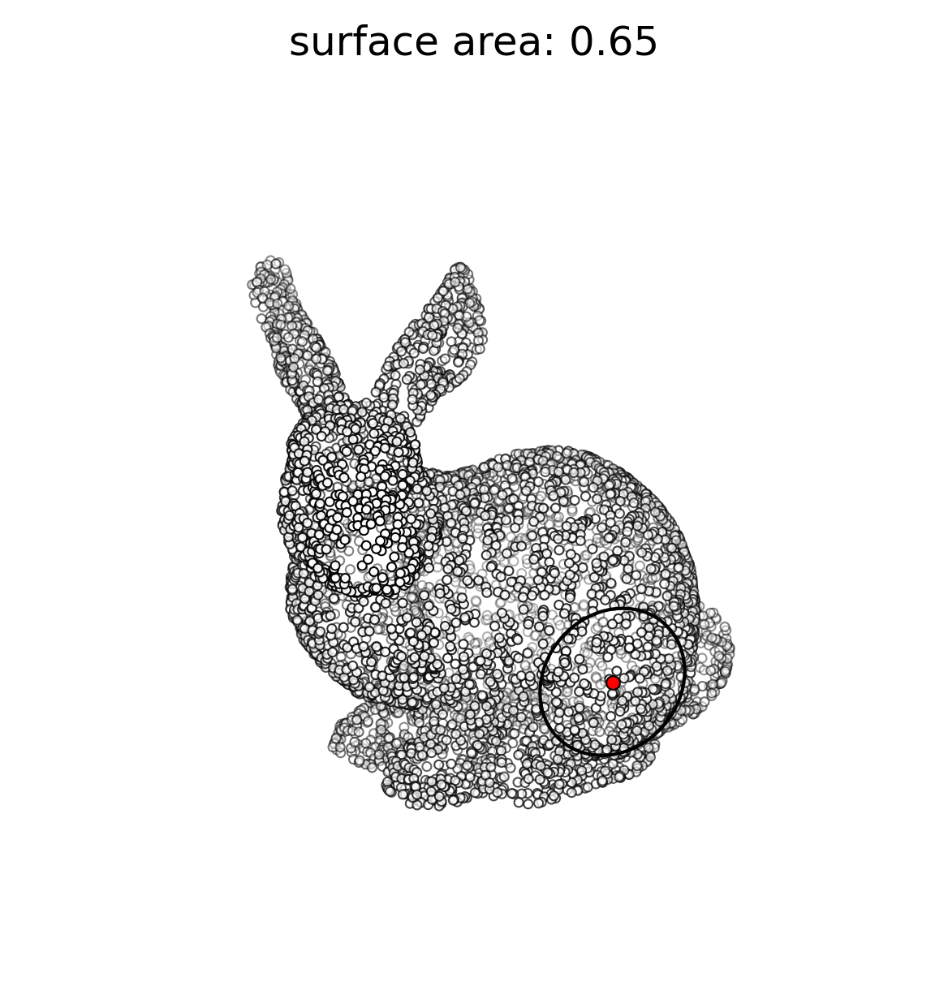

# PyOpenSurfaceArea

Estimates the area of an open surface represented as a point cloud in 3-D space.

## Installation

Clone the repo to your local machine and install it with
```shell
pip install .
```

## Usage

A simple example of estimating the surface area composed of all points within some radius around a targeted point on the surface of the Stanford bunny is shown below. Run `example.py` to reproduce this example.

```python
from matplotlib.patches import Circle
import numpy as np
from scipy import spatial

import pyosa


# laod the data
xyz = np.genfromtxt('bunny100k.xyz', delimiter=' ')
    
# downsampling the point cloud just a bit for visualization purposes
N = xyz.shape[0]
num = 0.05 * N
mask = np.arange(0, N, int(N/num))
xyz_ds = xyz[mask]
    
# extract an arbitrary, open surface for which we want to extract the area
point = xyz_ds[np.argmax(xyz_ds[:, 2]), :]
tree = spatial.KDTree(xyz_ds)
r = 0.5
ind = tree.query_ball_point(point, r)

# extraction of the surface area is as simple as
surf = xyz_ds[ind]
area = pyosa.estimate(surf)

# show the resulting figure
circle = patches.Circle(point, r, fc='none', ec='k')
fig, ax  = show_pcd(xyz_ds, point, circle)  # impementation in example.py
ax.set_title(f'surface area: {area:.2f}')
```

<p align="center"></p>

## Shortcomings

The current implementation is limited to open surfaces in 3-D space. The surface is assumed to have the least amount of variance in its "height" direction, that is, the surface is observed from the point of view on the normal at the center of the surface.

## License
[MIT](https://github.com/akapet00/pyosa/blob/main/LICENSE)